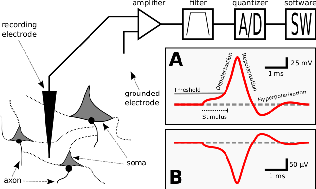

#############
Spike Sorting
#############

Spike sorting is a combined detection and classification task for transient
patterns in time series. In neuroscience this task is found when analysing
voltage traces recorded from the brain of mammals. This kind of recording
yields discrete time series that represent the brain activity of the cortex at
the site under consideration.

Single cells in the cortex (neurons) communicate by means of electrical and
chemical signals. These signals are called action potential (AP), and arise
when a neuron receive enough input signals from other neurons. The AP builds as
an ion current inside the cell body (soma) of the neuron. At certain threshold
levels the current flows out of the soma and is released into a transmission
channel (axon). At terminal points on the axon chemical transmission devices
(sysnapses) communicate the AP to other neurons, in turn exciting ot inhibiting
their activity. The ion current gives rise to a transmembrane potential as
ion are transported from one side of the membrane to the other. This (de-)
polarisation is measurable inside the neuron and in the medium surrounding the
neuron. The time course of the membrane potential during an AP, as measured in
the voltage trace recorded, has a very distinct gestalt, motivating the term
*spike*.

The aim of the spike sorting task is to identify the points in time when an
AP has occurred in the signal (spike detection) and to predict which of the
neurons present has emitted this spike (spike sorting).

.. todo:: might need references

Intracellular Recordings
========================

Voltage recordings from the inside of the neuron are called *intracellular
recordings*. This kind of recording can help to understand the intracellular
current dynamics. In general the detection of the AP for intracellular
recordings does not pose a challenge, so that this kind of recording will not
be considered in detail here.

.. todo:: might need references

Extracellular recording
=======================

The leading paradigm to record ensembles of neurons from the cortex is that
of extracellular recording. An electrode will be placed in the part of the
cortex under consideration and record from the local neuronal population.

.. _`fig-recording`:

   Cartoon of the experimental setup for extracellular recordings.

For further information about spike sorting please refer to the following
publications [Lewiki99]_, [Scholarpedia]_ and more recent and recommended
[Einevoll11]_.

.. _template-matching:

Template Matching
-----------------
Lorem ipsum dolor sit amet, consectetur adipiscing elit. Morbi bibendum, neque
eu hendrerit scelerisque, orci nisl auctor risus, pulvinar congue augue turpis
fermentum odio. Lorem ipsum dolor sit amet, consectetur adipiscing elit. Nullam
venenatis lacinia elit, id aliquet dolor ultricies non. Sed quam massa,
ullamcorper sit amet scelerisque et, volutpat nec erat. Curabitur tincidunt
scelerisque dolor sit amet bibendum. Class aptent taciti sociosqu ad litora
torquent per conubia nostra, per inceptos himenaeos. Cras fermentum hendrerit
mattis. Nam ullamcorper nisl lacinia tortor suscipit sed iaculis augue
dignissim. Integer magna leo, pulvinar a pellentesque in, tincidunt quis lacus.
Donec et urna iaculis elit mollis venenatis. Maecenas a enim vitae arcu semper
ultrices condimentum eu justo. In hac habitasse platea dictumst. Maecenas in
felis quis enim malesuada laoreet.

Bayes Optimal Template Matching
-------------------------------
Lorem ipsum dolor sit amet, consectetur adipiscing elit. Morbi bibendum, neque
eu hendrerit scelerisque, orci nisl auctor risus, pulvinar congue augue turpis
fermentum odio. Lorem ipsum dolor sit amet, consectetur adipiscing elit. Nullam
venenatis lacinia elit, id aliquet dolor ultricies non. Sed quam massa,
ullamcorper sit amet scelerisque et, volutpat nec erat. Curabitur tincidunt
scelerisque dolor sit amet bibendum. Class aptent taciti sociosqu ad litora
torquent per conubia nostra, per inceptos himenaeos. Cras fermentum hendrerit
mattis. Nam ullamcorper nisl lacinia tortor suscipit sed iaculis augue
dignissim. Integer magna leo, pulvinar a pellentesque in, tincidunt quis lacus.
Donec et urna iaculis elit mollis venenatis. Maecenas a enim vitae arcu semper
ultrices condimentum eu justo. In hac habitasse platea dictumst. Maecenas in
felis quis enim malesuada laoreet.

References:
-----------

.. rubric:: Weblinks

.. _`Python`: http://python.org/
.. _`Bayes Optimal Template Matching`:
  http://opus.kobv.de/tuberlin/volltexte/2012/3387/

.. rubric:: Publications

.. [Lewiki99]
  "A review of methods for spike sorting: the detection and
  classification of neural action potentials"
  M. S. Lewicki (1998), Network: Computation in Neural Systems,
  Vol. 9, No. 4. (1998), pp. 53-78

.. [Scholarpedia]
  Rodrigo Quian Quiroga (2007) Spike sorting. Scholarpedia, 2(12):3583.

.. [Einevoll11]
  "Towards reliable spike-train recordings from thousands of neurons with
  multielectrodes."
  Einevoll GT, Franke F, Hagen E, Pouzat C, Harris KD (2011),
  Curr Opin Neurobiol. 2011 Oct 22.
